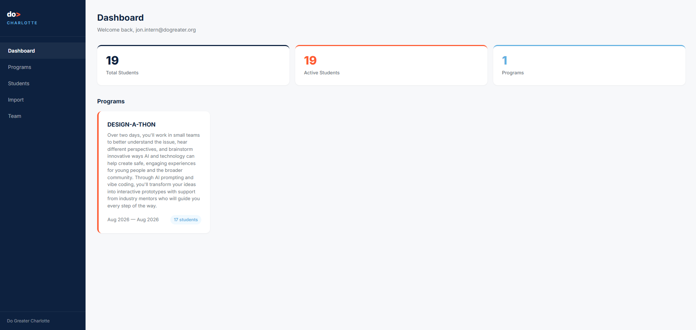

# Do Greater Student Database

A full-stack student database management system built for **Do Greater Charlotte**, a Charlotte-based youth non-profit. It replaced manual spreadsheet tracking with a secure, role-based web app for managing student records, guardian relationships, program participation, and bulk data import from the organization's Google Forms intake process.

**Live app:** https://student-database-xi.vercel.app
**Built by:** Jonathan Hardeman — Software Engineering Intern, Summer 2026 (solo full-stack engineer)

<!--
  SCREENSHOTS
  ------------
  Add screenshots to docs/screenshots/ and reference them below, e.g.:
  
  Suggested shots: login, dashboard, students list (with filters), a student
  profile (with attachments), the import preview, and programs.
-->

## Overview

Do Greater Charlotte previously tracked student, guardian, and program data across a set of shared spreadsheets — slow to search, easy to accidentally overwrite, and with no real access control. This app replaces that with:

- A searchable, filterable student roster with full profiles (personal, contact, academic, guardian, and program history).
- Program management with enrollment tracking (active vs. past).
- A guided bulk-import pipeline that turns the org's Google Forms intake CSV directly into student + guardian records, without corrupting existing data on re-import.
- Google OAuth sign-in restricted to the organization's team, with admin/staff permission tiers enforced at the database level.

## Features

**Student & Program Management**
- Full student profiles: personal, contact, academic, and additional info, plus guardian relationships and program enrollment history.
- Program pages with active/past enrollment tables.
- Image attachments per student (e.g. reference photos, signed forms) via private, signed-URL Supabase Storage.
- Search, plus filter by status, school, grade level, and IEP/504 on the student list.
- Bulk actions: change status or enroll a group of selected students in a program at once.
- CSV export of the current filtered view or selection — the roster in, the roster back out.
- Admin-only student deletion, with guardian/program/attachment cleanup and a retry-safe delete flow.

**Bulk CSV Import**
- Upload a renamed Google Forms export and get a full preview — grouped into **new**, **duplicate** (already in the database, safely skipped so re-uploading the same export never creates doubles), and **invalid** (missing name, unparseable date, etc.) — before anything is written.
- A field-completeness panel flags columns that are unexpectedly empty across every row, which is almost always a header-mapping mistake rather than genuinely missing data — catching that before import instead of after saves a debugging round trip.
- Automated guardian-student linking from the CSV's form-submission timestamp, with a post-import check that flags any student whose guardians didn't link so it's never a silent failure.
- Download a CSV of anything skipped, with the reason, for the record.

**Authentication & Authorization**
- Google OAuth via Supabase Auth, gated to the organization's team.
- Role-based access (admin / staff) enforced by Postgres Row Level Security — not just hidden in the UI.
- Team management page (admin-only) for assigning roles; new team members get access simply by signing in, then get promoted from there.

## Tech Stack

| Layer | Technology | Purpose |
|---|---|---|
| Database | PostgreSQL (Supabase) | Relational data storage |
| Auth | Supabase Auth + Google OAuth | Team authentication via Google Suite |
| Security | Row Level Security (RLS) | Database-level access control |
| Storage | Supabase Storage | Private, signed-URL student attachments |
| Frontend | Next.js 15 + React 19 | Server and client components |
| Language | TypeScript | Type-safe development |
| Styling | Tailwind CSS + inline styles | Brand-consistent UI |
| Hosting | Vercel | CI/CD and production deployment |
| CSV Parsing | PapaParse | Google Forms data import/export |

## Database Design

8 tables, normalized, with UUID primary keys (chosen over sequential integers so student record IDs aren't guessable/enumerable):

- `students`, `guardians`, `student_guardians` (many-to-many junction — one guardian can have multiple children in the program)
- `programs`, `student_programs` (junction with enrollment/exit dates and notes)
- `profiles` (role per authenticated user: admin / staff)

Row Level Security policies enforce admin/staff permissions at the database engine level — the UI hides buttons a staff member shouldn't see, but RLS is what actually prevents the underlying request from succeeding even if someone bypassed the UI.

## Getting Started

### Prerequisites
- Node.js 20+
- A Supabase project (free tier is fine)
- A Google Cloud OAuth client (for sign-in)

### 1. Clone and install

```bash
git clone https://github.com/JonHa3/student_database.git
cd student_database
npm install
```

### 2. Configure environment variables

Copy `.env.example` to `.env.local` and fill in your Supabase project's URL and keys (Project Settings > API in the Supabase dashboard):

```bash
cp .env.example .env.local
```

### 3. Set up Supabase

- Create the `students`, `guardians`, `student_guardians`, `programs`, `student_programs`, and `profiles` tables with RLS enabled (see Database Design above for the shape).
- Run `supabase/setup_attachments.sql` once in the Supabase SQL editor to enable the student attachments feature (creates a private storage bucket + access policies).
- In **Authentication > URL Configuration**, add both your production URL and `http://localhost:3000/auth/callback` to the allowed redirect URLs — sign-in redirects to whichever origin the request came from, so local dev needs to be explicitly allowed too.
- In **Google Cloud Console**, add the Supabase auth callback URL as an authorized redirect URI for your OAuth client.

### 4. Run it

```bash
npm run dev
```

Open http://localhost:3000. The first person to sign in with Google won't have a role yet and won't see any data — manually set that first account's role to `admin` directly in the `profiles` table in Supabase; from there, that admin can manage everyone else's role from the Team page.

## Importing Students

The `/import` page expects a CSV with these column headers (case/spacing-insensitive):

`first_name, last_name, birthday, gender, pronouns, race_ethnicity, primary_language, school, grade_level, grad_year, personal_email, phone_number, street_address, city, zip_code, free_reduced_lunch, dietary_restrictions, shirt_size, iep_or_504, iep_504_details, created_at, guardian_first_name, guardian_last_name, guardian_phone_number, guardian_email, guardian_relationship, secondary_first_name, secondary_last_name, secondary_phone_number, secondary_email, secondary_relationship`

`created_at` should be the form's submission timestamp — it's what links a student to their guardian(s) from the same submission. Every upload shows a full preview (new / duplicate / invalid, plus a field-completeness check) before anything is written, so it's safe to re-upload the same or an overlapping export.

## Project Structure

```
src/
  app/
    page.tsx                    Dashboard
    students/                   Student list, profile, add/edit
    programs/                   Program list, detail, add/edit, enroll
    import/                     Bulk CSV import wizard
    team/                       Admin-only team & role management
    login/, auth/callback/      Google OAuth sign-in flow
  components/
    sidebar.tsx, clientlayout.tsx   App shell / navigation
    studentattachments.tsx          Image attachments (Supabase Storage)
  lib/
    supabase.ts, supabase-server.ts Supabase client helpers (browser/server)
    csv.ts                          Shared CSV download helper
  middleware.ts                 Login-gates every route
supabase/
  setup_attachments.sql         One-time storage bucket + policy setup
```

## Technical Challenges Solved

**UUID vs. Integer Primary Keys** — Switched to UUIDs so student record IDs aren't guessable/enumerable, since sequential integers would let someone iterate through every student by changing a number in the URL.

**Many-to-Many Guardians** — A junction table (`student_guardians`) supports one guardian having multiple children in the program, and prevents an incorrect cascading delete from wiping out a guardian who's still linked to another student.

**CSV Import Pipeline** — Splits one Google Forms CSV into students, primary guardians, and secondary contacts, links them by submission timestamp, and — added in this pass — classifies every row as new/duplicate/invalid *before* writing anything, so re-uploading an export that overlaps with existing data never creates duplicate students.

**RLS Infinite Loop** — Debugged a circular permission issue where the `students` policy couldn't read the `profiles` table to check roles; resolved with explicit `GRANT` statements.

**OAuth Redirect Loop** — Traced a production redirect loop to a missing `https://` prefix in the Supabase Site URL and a hardcoded (non-dynamic) `redirectTo` in the login page; the redirect is now built from `window.location.origin` so it works in local dev, previews, and production alike.

**Hydration Mismatches** — Resolved server/client HTML mismatches caused by `window.location` usage in server-rendered components, using `useEffect` patterns instead.

**Date Timezone Bug** — Fixed dates displaying one day off by appending `T00:00:00` to force local timezone interpretation instead of UTC.

**Partial-Failure Deletes** — The admin student-delete flow touches four different tables/storage in sequence with no database transaction available from the client; it now checks the result of every step and stops with a specific, actionable error the moment something fails, rather than silently leaving the data half-cleaned-up.

## Known Limitations

- No automated test suite yet.
- `emergency_contact_name` / `emergency_contact_phone` exist in the database and display on a student's profile, but aren't yet editable from the add/edit forms.
- No in-app invite flow — a new team member gets access by simply signing in with Google, then an admin assigns their role from the Team page.

---

*Stack: Next.js · TypeScript · PostgreSQL · Supabase · Google OAuth · Vercel*
